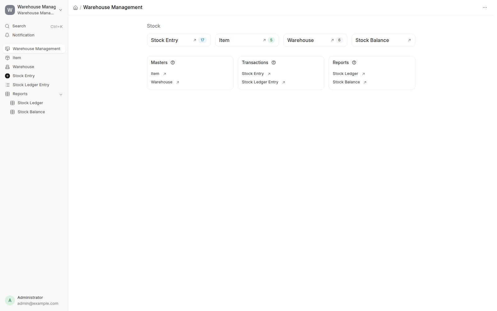
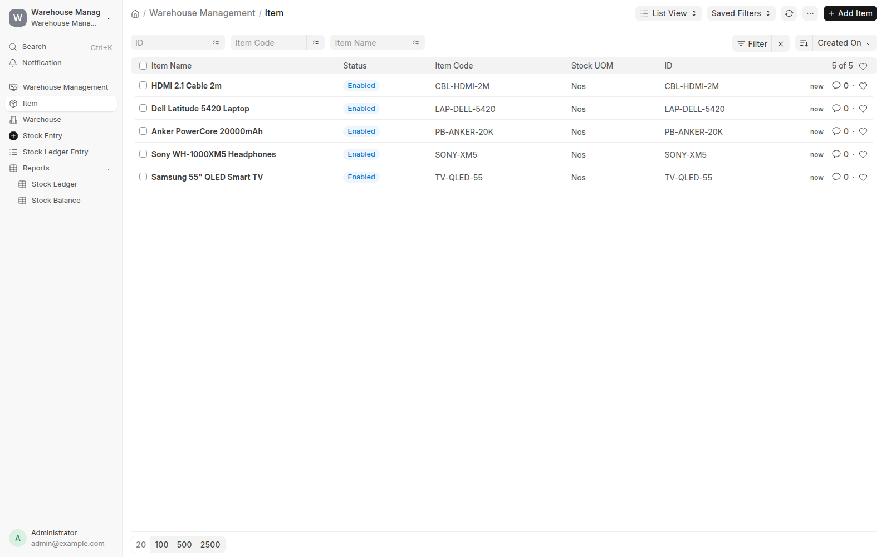
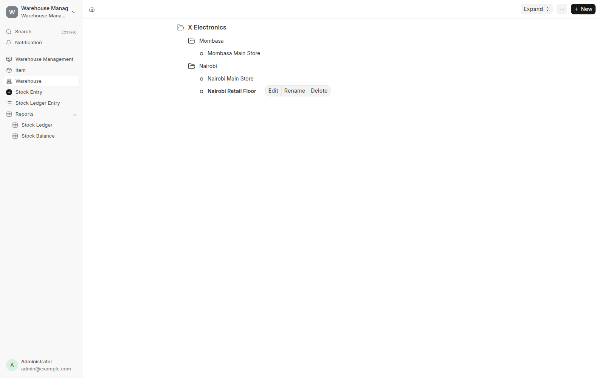
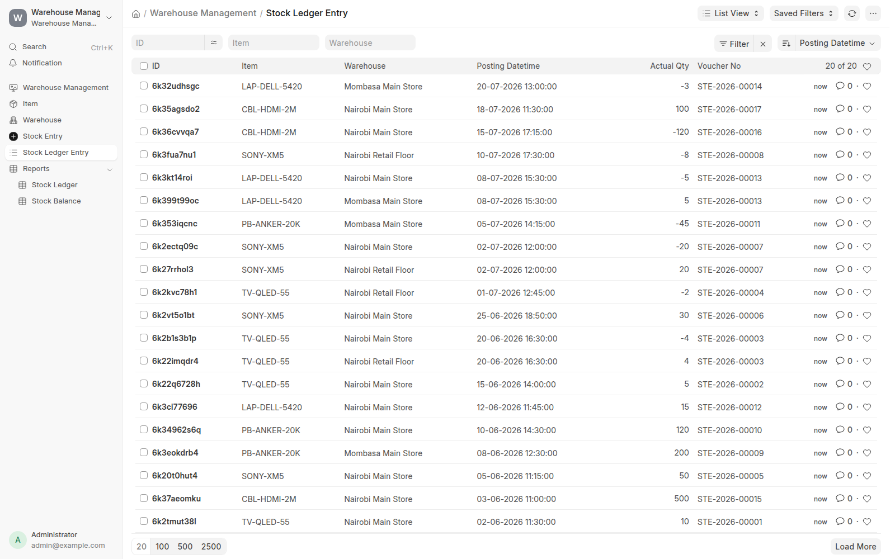
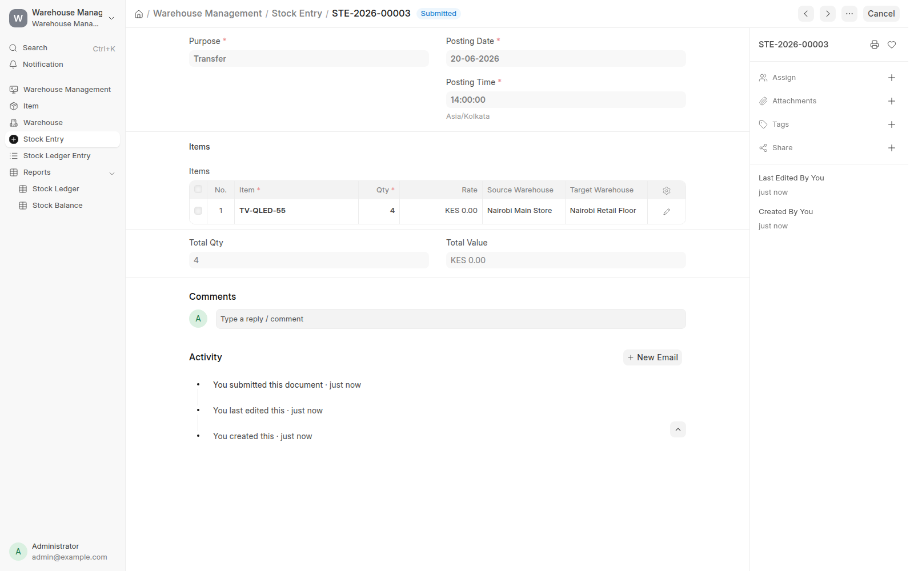
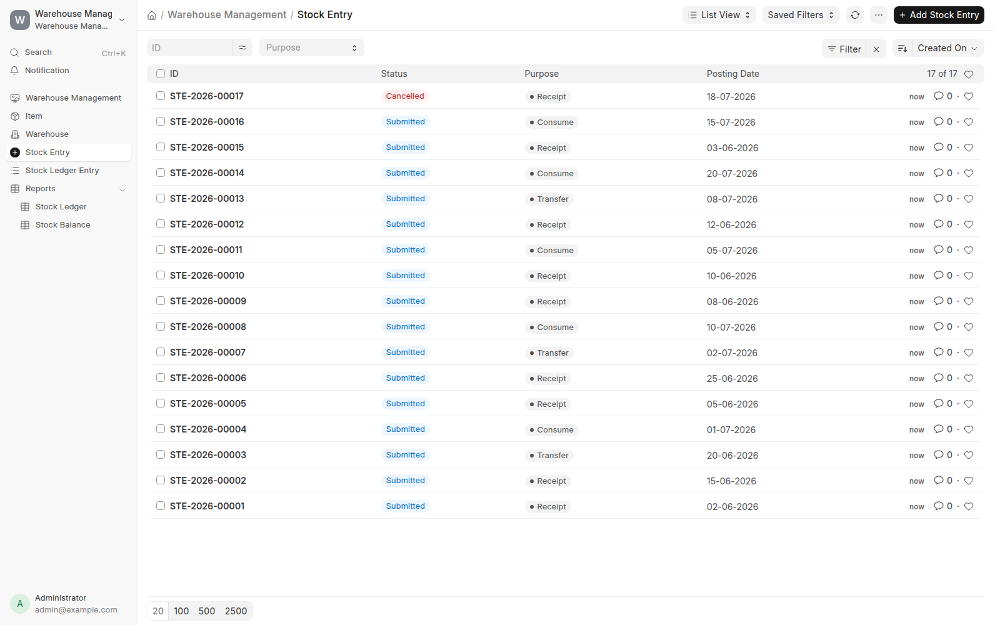
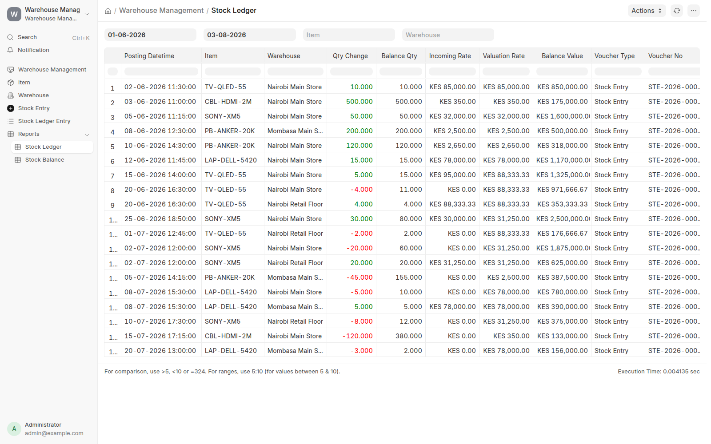
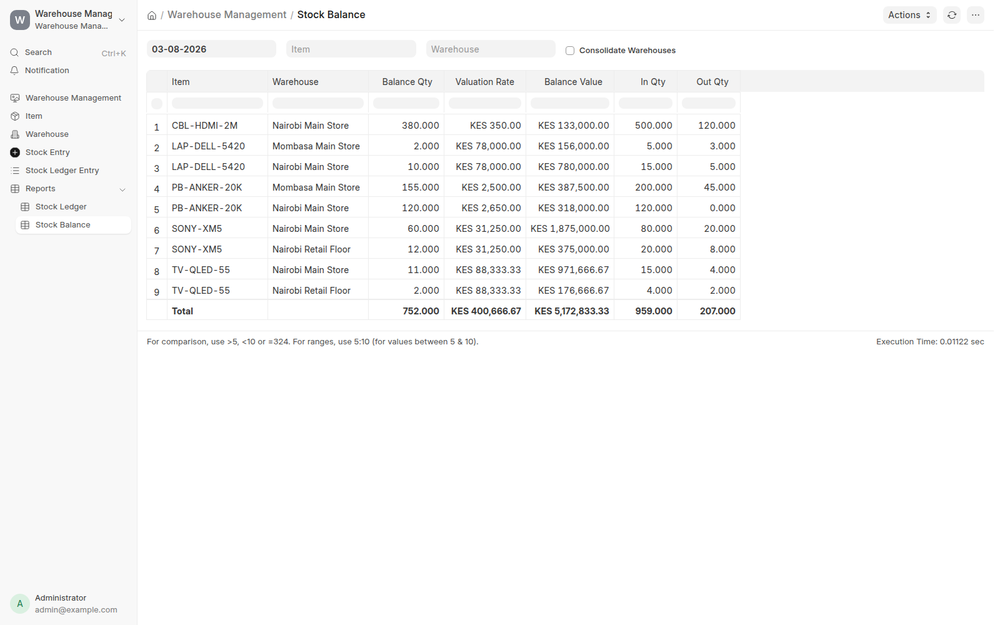
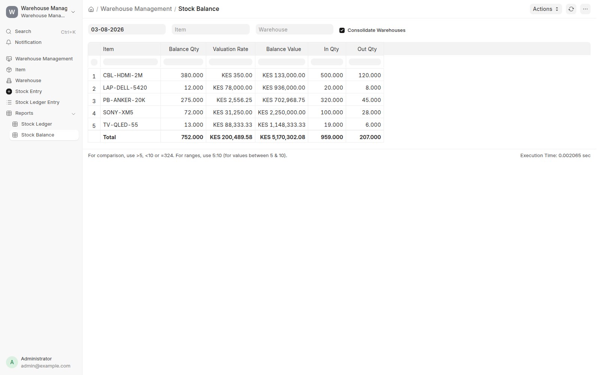

## Warehouse Management

Stock tracking for X Electronics. It's a standalone Frappe app, so it doesn't
need ERPNext installed.



### Why there's no balance column anywhere

This is the decision that shapes everything else, so it's worth explaining up
front. Nothing in this app stores a running balance or a cached valuation rate.
There's no `Bin` table. Every quantity and every value you see gets worked out
by summing `Stock Ledger Entry` rows at the moment you ask for it.

ERPNext does the opposite. It keeps `qty_after_transaction` and `valuation_rate`
on each ledger row. Reading is cheap that way, but a backdated entry means it
has to walk forward and rewrite every row after the one you inserted. A fair
amount of ERPNext's stock complexity lives in that rewrite.

Because I never store those numbers, there's nothing to rewrite. A backdated
entry is just another row and the next read accounts for it. Reads cost more in
exchange, which felt like the right way round for a ledger that gets reported on
far more often than it gets written to.

### DocTypes

| DocType | Notes |
|---|---|
| Item | Named by `item_code`. Carries the `valuation_method`. Stock UOM and valuation method both lock once ledger entries exist. |
| Warehouse | Tree (`NestedSet`, lft/rgt). Group nodes can't hold stock, and you can't delete one that ledger entries still point at. |
| Stock Entry | Submittable voucher. Purpose is Receipt, Consume or Transfer. |
| Stock Entry Detail | Child table: item, qty, rate, source and target warehouse. |
| Stock Ledger Entry | Append-only. Signed `actual_qty`, `incoming_rate`, `is_cancelled`, and a link back to the voucher. |



Warehouses are a real tree, not a flat list with a parent field bolted on. Group
nodes (cities, regions) organise the stock-holding leaves under them.



The ledger is the entire state of the system. Signed quantities, a posting
datetime, and a pointer to whatever wrote the row. Nothing else.



### Valuation methods

Every item carries a `valuation_method`: **Moving Average** (the default), **FIFO**
or **LIFO**. Quantity is never affected, only value. Pick it on the Item.

The field locks as soon as ledger entries exist, for the same reason Stock UOM
does. Changing the method doesn't change what happens next, it restates every
figure you have already reported, because value is replayed from the ledger at
read time rather than stored.

#### What each one does

Take three movements against one warehouse: **10 @ 100**, then **30 @ 200**, then
**20 out**. Twenty units are left under all three methods. What they're worth
depends entirely on which you picked.

| Method | What it holds | Rate | Value of the 20 on hand |
|---|---|---|---|
| Moving Average | one blended cost for everything | 175 | **3,500** |
| FIFO | the newest layers, oldest issued first | 200 | **4,000** |
| LIFO | the oldest layers, newest issued first | 150 | **3,000** |

Moving Average blends: `(10×100 + 30×200) / 40 = 175`, and every unit is worth
that regardless of when it arrived. FIFO issues the 100s first, so what's left
is 20 of the 200s. LIFO issues the 200s first, so 10 of the 100s survive
alongside 10 of the 200s.

A thousand shillings of difference on identical stock. That's the whole point of
the setting, and it's why it can't be changed once entries exist.

#### The effects, one by one

**Value on hand changes, quantity never does.** All three agree there are 20
units. `get_stock_balance` doesn't consult the method at all.

**The cost of what leaves changes.** Moving Average issues everything at the
average. FIFO issues at the oldest layer, LIFO at the newest. Issuing 10 from
10 @ 100 plus 10 @ 200 costs 150/unit under Moving Average, 100 under FIFO and
200 under LIFO. That's `get_outgoing_rate`, and it's a different question from
"what is my remaining stock worth" — under FIFO and LIFO the stock that goes and
the stock that stays are priced differently.

**Transfers price differently but stay value-neutral under all three.** The
receiving warehouse is charged whatever left the source, so moving stock never
creates or destroys value:

| Method | Rate onto the target | Source keeps | Target gets | Total |
|---|---|---|---|---|
| Moving Average | 175 | 3,500 | 3,500 | 7,000 |
| FIFO | 150 | 4,000 | 3,000 | 7,000 |
| LIFO | 200 | 3,000 | 4,000 | 7,000 |

Under FIFO a transfer that spans two layers is priced at their blend — 10 @ 100
plus 10 @ 200 is 3,000 for 20 units, so 150. Rows within a single Stock Entry
draw from the same layers in order, so two transfers of 10 take the 100 layer
and then the 200 layer rather than both claiming the 100s.

**Backdating behaves differently.** Under Moving Average a backdated receipt just
joins the weighted average. Under FIFO and LIFO it lands at a *position* in the
queue, so it changes which layer is issued next. Receive 10 @ 200 in June,
backdate 10 @ 100 to January, then issue 10: FIFO now sends the January layer,
which didn't exist when the June receipt was posted. Nothing had to be rewritten
for that to work — the queue is rebuilt from the ledger on every read.

**Consolidated valuation is more correct under FIFO and LIFO.** Consolidating
sums each warehouse's real layers. Moving Average consolidation re-derives one
average from the incoming rows across warehouses, which double-counts the
incoming side of a transfer. With two warehouses holding the same item at
different costs, a transfer between them shifts the consolidated Moving Average
value even though nothing entered or left the business. FIFO and LIFO don't have
this problem, and `test_consolidated_transfer_is_value_neutral_across_mixed_rates`
pins it down. See the gaps section.

**Reads cost more under FIFO and LIFO.** Moving Average is still one SQL query:

```
rate = SUM(actual_qty * incoming_rate) / SUM(actual_qty)    over incoming rows only
```

FIFO and LIFO can't be reduced to an aggregate, because which units you're
holding decides what they're worth. They replay the movements in order and
maintain the layers still on hand. Stock Balance keeps the single grouped query
for Moving Average items and adds a second pass only when a layered item is
actually in the result, so the default path is unchanged. Stock Ledger already
walked the rows in order for its running balance, so layered methods cost it
nothing extra.

#### Where it lives

`warehouse_management/valuation.py` holds `ValuationState`, which is the only
implementation of valuation in the app. Feed it ledger rows in posting order and
`qty`, `value` and `rate` are correct after every row. The reports, the transfer
pricing and the point-in-time helpers all drive that same class, so the three
methods can't drift apart between them.

Outgoing rows never carry a rate, and that's enforced in two places rather than
one. Stock Entry zeroes the rate on anything that isn't a Receipt, and Stock
Ledger Entry zeroes `incoming_rate` on any negative row no matter what it was
handed. Every method depends on `actual_qty > 0` being a reliable test for "this
row has a cost", so it's guarded at the ledger boundary and not just in the
controller.

### What each purpose writes

| Purpose | Ledger rows |
|---|---|
| Receipt | one `+qty` row at the rate you entered |
| Consume | one `−qty` row at rate 0 |
| Transfer | a `−qty` row at the source, and a `+qty` row at the target carrying the cost of the stock that left |

Carrying the source valuation across is what keeps a transfer value-neutral.
Moving stock between warehouses shouldn't create or destroy value. What that
cost is depends on the item's valuation method — the average under Moving
Average, the layers the draw reaches under FIFO and LIFO — but the neutrality
holds either way. `test_transfer_carries_valuation_across` checks it directly,
`test_transfer_is_value_neutral_when_consolidated` checks it across the whole
system, and `test_transfer_is_value_neutral_under_every_method` checks all three
methods agree that value is conserved.

A Receipt needs a rate and a target warehouse:


A Transfer needs both warehouses and no rate, since the value comes from the
source rather than from you:



All three purposes together, plus a cancelled entry:



### Negative stock

There are two guards here. The first, `validate_stock_availability`, asks
whether there's enough on hand at the moment you're posting. It handles the
ordinary case and gives a useful per-row error message.

The second one, `validate_timeline_stays_positive`, exists because the first is
blind to a problem that a stateless ledger invites. If you backdate an issue, or
cancel a receipt whose stock has since been used, you leave an entry that
already exists sitting overdrawn. Every one of those entries looked fine when it
was posted. Both cases are easy to reproduce:

```
receipt 10 @ Jan, consume 10 @ Jun, then consume 10 backdated to Mar → balance -10
receipt 10, consume 8, then cancel the receipt                       → balance -8
```

So `get_first_negative_balance` walks the timeline and returns the first point
where the running balance goes below zero. It accepts rows that aren't in the
ledger yet and a voucher to leave out, which lets both submit and cancel check
the timeline they're about to create before they create it. Nothing that gets
rejected ever needs unwinding.

I found this by writing the two cases above and watching them fail, so it's
worth saying the original code shipped with the bug.

### Cancellation

Cancelling sets `is_cancelled = 1` instead of deleting anything, so the audit
trail stays intact. Every balance, valuation and report query filters on
`is_cancelled = 0`, so only the live view changes.

### Reports

**Stock Ledger** gives one row per movement with a running balance and running
valuation across whatever window you filter to. Negative quantities show in red.
Filters are date range, item and warehouse.



The TV rows show the moving average working. Ten arrive on 02-06 at KES 85,000,
five more on 15-06 at KES 95,000, and the rate becomes KES 88,333.33, which is
`(10 × 85,000 + 5 × 95,000) / 15`. The consumption on 01-07 changes the balance
and leaves the rate alone, because only incoming rows count toward the average.

**Stock Balance** gives quantity, valuation rate and value as on a date, in one
grouped query. Filters are as-on date, item, warehouse and consolidate.



Ticking `Consolidate Warehouses` collapses it to one row per item. PB-ANKER-20K
is the interesting one, since it's stocked in both Nairobi and Mombasa at
different rates and blends to KES 2,556.25.



The numbers in these screenshots are demo data I seeded to make the reports
worth looking at. The app installs empty.

### Installation

```bash
cd $PATH_TO_YOUR_BENCH
bench get-app git@github.com:kenkomu/warehouse_system-frappe.git --branch main
bench install-app warehouse_management
```

It ships its own workspace, sidebar and desk icon, so it turns up on the desk
landing screen and `/app/warehouse-management` is a real home page rather than a
list of loose DocTypes.

One thing to know: the DocTypes grant permissions to `Stock Manager` and
`Stock User`, but the app doesn't create those roles yet. On a fresh install
only System Manager can get in. Create the two roles by hand, or see the gaps
section below.

### Tests

```bash
bench --site $YOUR_SITE run-tests --app warehouse_management
```

96 tests, about 7 seconds. The brief asked for all non-report functionality to
be covered and said reports could have unit tests too, so both are in there:

| Suite | Tests |
|---|---|
| Stock Entry | 26 |
| Stock Ledger Entry | 13 |
| Valuation | 27 |
| Stock Balance report | 10 |
| Stock Ledger report | 9 |
| Warehouse | 6 |
| Item | 5 |

The valuation suite runs the same three movements under each method and asserts
the three different answers, then repeats that through real Stock Entries, both
reports, and transfers.

`WarehouseTestCase` overrides `tearDown` so each test rolls back on its own.
Frappe's `IntegrationTestCase` registers its rollback through `addClassCleanup`,
which only fires once the whole class has finished. These tests assert on stock
balances, so documents leaking from one test into the next made them fail
depending on what order they ran in.

### Known gaps

- Consolidated Stock Balance re-averages incoming rows for Moving Average items,
  so a transfer between two warehouses holding the same item at different costs
  shifts the consolidated value even though nothing entered or left. Per-warehouse
  figures are unaffected, and FIFO and LIFO don't have the problem because they
  sum real layers. Fixing it properly needs the ledger to mark transfer-generated
  incoming rows, since right now the row can't tell itself apart from a receipt.
- `disabled` on Item and Warehouse is in the schema but nothing acts on it.
- The `Stock Manager` and `Stock User` roles aren't created on install, so a
  fresh install only works for System Manager.
- `get_children` and `add_node` (the tree view endpoints) aren't tested, and
  neither is document amendment.
- The workspace, sidebar and desk icon ship as fixtures with no tests behind
  them. The screenshots above are the only thing verifying they render.

### Contributing

Formatting and linting go through `pre-commit` (ruff, eslint, prettier,
pyupgrade):

```bash
cd apps/warehouse_management
pre-commit install
```

### License

mit
